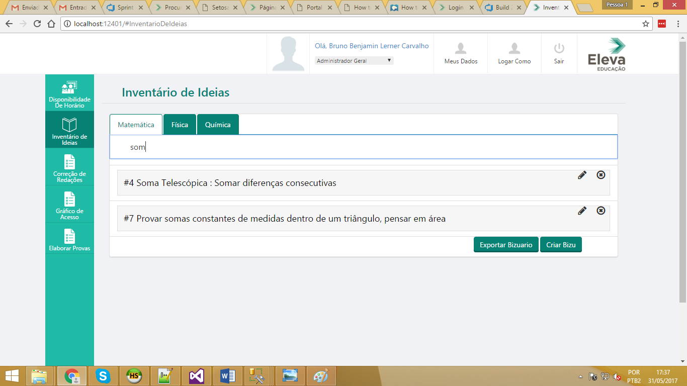

# Bizuario Online

The idea of this project is to create a new content for the student. A way to synthesize the important aspects of problem solving.

## How does it work?

~ A platform where the student can save simple hints that can be related to various kinds of problems.

~ These hints can be linked to real problems that were solved using that.
 
~ Should also be possible to tag the problems with the hints.

~ When the user clicks the saved hint, should see a theoretical explanation for why that works

## Pictures of prototype

### Drawing of the idea

### Pictures of the beggining of implementation

## Not Standalone

The development began in the end of my first IT internship at Eleva Educacao, so it is not a standalone version, the code exposed here was built under the company code structure. 
